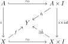

# Definition of cofibration map

Welcome to today's dose of algebraic topology! I've just started reading the amazing book by J.P.May. I don't plan to post all exercises, but there's many things so thrilling I can't resist writing down~ qwq

~~Subtitle: Commutative Diagram Test Post~~

The category we work in is $\mathrm{CGWH}$, i.e., the full subcategory of $\mathrm{Top}$ with objects the weak Hausdorff k-spaces.

It has a structure of internal $\operatorname{Hom}$: We give $Y^X:=\operatorname{Hom}(X,Y)$ the *k-ification* (the right adjoint of forgetful $\mathrm{kTop}\hookrightarrow\mathrm{Top}$) of the compact-open topology (given by the subbase $
\{U^K:K\text{ compact}, U\text{ open}\}$). Then the category is cartesian closed with respect to it: For any $X,Y,Z\in\mathrm{CGWH}$,
$$Z^{X\times Y}\simeq(Z^Y)^X.$$

Therefore a homotopy $X\times I\to Y$ is the same as a map $X\to Y^I$. 
- This is just to explain the choice of this category. What we're doing today is still point-set fashion and do not involve these complexities. I'm probably writing notes on that part later.

---

We define a cofibration to be a map $i:A\to X$ such that in the following diagram

if the square $h\circ\iota_0=f\circ i$ commute, then there exists some $\tilde h$ that extends $h$. This is called the homotopy extension property.

---
Post date: 2024/11/05 \
[Home page](https://caelestia.github.io)